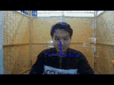

# Canoe-电脑开发端

基于AIoT设备“学习伙伴”的智慧教育快应用

> Canoe电脑端开发代码，用于对AIoT设备“学习伙伴”内部预装程序的试运行，有利于软件开发的快速迭代。对不同的技术功能模块同时也包含了部分模型的训练与转化代码。


## 版本更改记录

v1.0 初始版本


## 目录

[TOC]

## 安装

### 1. 配置Python环境

```
windows, python3.6, cuda10.0, cudnn7.4
```


### 2. 相关Python库安装（主要）

#### （1）深度学习框架

```
pip install tensorflow
```
#### （2）图像处理

```
pip install opencv-python
```
#### （3）常用人脸处理库

```
pip install dlib
```
#### （4）服务器相关

```
pip install flask
```
#### （5）试运行界面

```
pip install PyQt
```


## 运行

### 1. 主程序

```
python main.py
```

### 2. 各模块demo

```
# 1.疲劳检测
python test_fatigue_detection.py
# 2.走神检测
python test_wandering_detection.py
# 3.姿态估计
python test_pose_estimation.py
# 4.身份验证
python test_identity_verification.py
# 5.活体检测
python test_liveness_detection.py
```


## 示例

### 1.疲劳检测


### 2.走神检测


### 3.姿态估计



### 4.身份验证


### 5.活体检测

