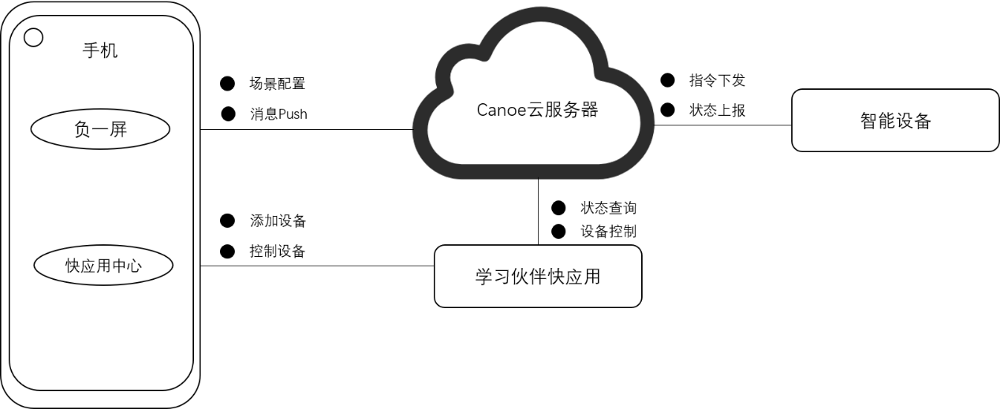
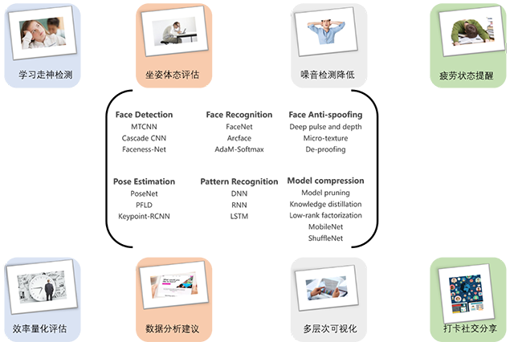
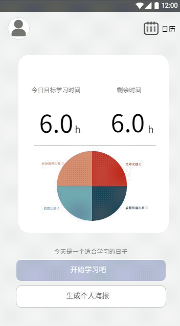

# Canoe

基于AIoT设备“学习伙伴”的智慧教育快应用

>  “Canoe”最终以物联网设备“学习伙伴”与快应用程序“Canoe”深度结合的形式呈现，能够完整、可靠、快速的实现多项智慧教育功能，展现出一个便捷的，可用的，有商用价值的产品。该项目立足于物联网设备，利用关键点检测、姿态估计等多种深度学习数据处理技术，使用边缘计算的方式，使得用户可以通过快应用获取相关信息与建议。

## 版本更改记录

v1.0 初始版本

（已停止更新）

## 目录

[TOC]

## 文件目录

Canoe

​	-BackBone (电脑开发端源代码与README)

以下已停止更新

​	-CloudServer (云服务器端源代码与README)

​	-image (用于存放示例图片)

​	-IoT (IoT端与README)

​	-QuickApp (QuickApp端源代码与README)

​	README.md (项目README)

## 软件框架

## 运行环境

​	电脑端软件开发试运行为Windows系统，Python3.6，TensorFlow2.0（内含Tensor Lite框架），OpenCV-Python4.1.0.25，dlib，PyQt。

​	物联网设备的运行环境为Linux 操作系统，Python3.6，TensorFlow2.0（内含Tensor Lite框架），Flask1.1.1，OpenCV-Python4.1。

​	快应用作为基于手机硬件平台的新型应用形态，具有良好的普适性，故“Canoe”可以兼容大多数国内主流厂商手机品牌。

## 主要功能

(1) 学习走神检测

走神广义地包含离开座位与四处张望等动作。通过物联网摄像头传输的视频流，运用人脸检测，人脸识别和活体检测等神经网络模型观察用户是否注意力在正常学习范围内，并在用户走神时通过快应用进行走神提醒。

(2) 坐姿体态评估

通过物联网摄像头传输的视频流，运用人体关键点检测等神经网络模型观察用户学习时体态特征是否正确，若又长时间的不健康姿势则通过快应用进行坐姿规范提醒。

(3) 疲劳状态提醒

通过物联网摄像头传输的视频流，运用人脸关键点检测等神经网络模型观察用户疲劳状态，过度疲劳地学习不益于长期学习发展，应该对疲劳用户做出不同程度的提醒。

(4) 噪音检测降低**

使用物联网设备采集用户学习环境产生的无用噪音，对所在环境噪音做出评估，并使用白噪音等有效降噪手段进行过滤。

(5) 效率量化评估**

运用模式识别，通过用户的学习数据信息，智能分析用户学习效率，使用量化指标评价其学习过程。

(6) 数据分析建议**

运用模式识别，结合用户长期学习特征，给予用户可靠的数据分析与可行建议。

(7) 多层面可视化

通过多种多层次可视化手段，让用户可以更直观地了解到自己的学习状态。

(8) 打卡社交分享**

通过手机快应用连接社区，鼓励用户学习分享，让更多的人见证陪伴用户学习

> **待完成项目

## 示例

